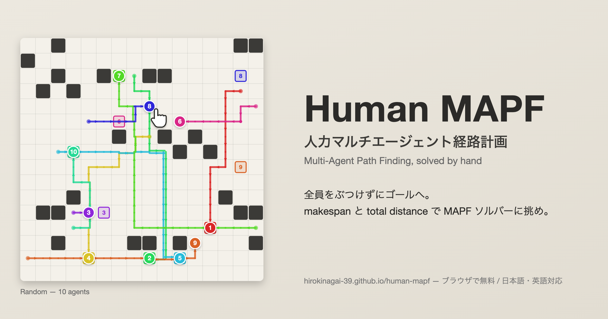

# Human MAPF — 人力マルチエージェント経路計画パズル



**Human MAPF** は、マルチエージェント経路計画 (MAPF) を人力で解くパズルゲームです。
全エージェントを衝突なくゴールへ導き、**makespan** と **total distance** (総移動距離) をできるだけ小さくします。
各ステージには LNS2 ソルバーの参考解が埋め込まれており、それを基準に GOLD / SILVER / BRONZE のランクが付きます。
UI は日本語 / 英語を切り替えられます。

正解すると **オンラインランキング** (ステージごとに makespan 部門・total distance 部門) に登録でき、
解答のアニメーションを **GIF で保存**、ステージ・スコア・順位を **𝕏 (Twitter) に投稿** できます
(𝕏 の仕様上 GIF は自動添付できないので、保存した GIF を投稿画面にドラッグ&ドロップしてください)。

## 遊ぶ

**オンライン (推奨)**: https://hirokinagai-39.github.io/human-mapf/ をブラウザで開くだけです。インストール不要、スマホ・タブレットでも遊べます。

**オフライン**: `dist/mapf_puzzle.html` をブラウザ (Chrome / Edge / Firefox / Safari) で開くだけです。
ホーム画面でステージ (マップ × agents 数) を選ぶとゲーム画面に移ります。ホーム画面下部と、ゲーム画面の「? 遊び方」にイラスト付きのルール説明 (衝突ルールなど) があります。
サーバーもインストールも不要で、Windows / macOS / Ubuntu いずれでも動きます。
配布する場合はこのファイル 1 つを渡してください (CSS / JS / 効果音すべて内包)。

## ルール

- 各時刻、エージェントは上下左右に 1 マス移動するか、その場で待機します。
- 同じ時刻に同じマス (頂点衝突) / 隣接 2 エージェントが同じ辺を逆向きに同時に通る (辺衝突 = 逆走・すれ違い禁止) は禁止。衝突位置に赤い × と時刻が表示されます。
- 来た道をすぐ戻る動き (A→B→A) や待機は自由です。
- 経路が終わったエージェントは最後のマス (ゴール) に留まり続けます (他の邪魔になります)。ゴールに着いた後に再び動くこともできます (最終的にゴールに戻っていれば OK)。
- **採点** で全員がゴールに到達し衝突がなければ、動きを滑らかに再生してからランクを表示します。
  ランクは makespan と total distance の**両方**が参考解 (LNS2) の何 % かで決まります:
  - DIAMOND: 100% 以下 (参考解と同等以上)
  - PLATINUM: 110% 以下
  - GOLD: 120% 以下
  - SILVER: 130% 以下
  - BRONZE: 150% 以下
  - それ以上は CLEAR (ランクなし)

## 操作

| 操作 | 内容 |
|---|---|
| 先端 (丸) をドラッグ | 通ったマスを経路に追加。同じドラッグ内で 1 つ前に戻ると取り消し |
| 先端をクリック | 1 時刻待機 (経路上の ● 印) |
| 先端を右クリック | 最後の 1 手を削除 |
| ↑↓←→ / WASD, Space / Q | 選択エージェントを移動 / 待機 |
| Backspace / Delete | 最後の 1 手を削除 / 経路を全消去 |
| Tab, 1〜9, ゴール・経路クリック | エージェント選択 |
| Ctrl+Z / Ctrl+Y | Undo / Redo |
| Enter / Esc | 採点 / 再生停止 |

## ステージ

ステージは「マップ × agents 数」です。障害物・スタート・ゴールはすべて固定で、何度開いても同じ問題になります。

| マップ | サイズ | 説明 | agents |
|---|---|---|---|
| tutorial | 4×4 | 障害物 2 つ。対角の 2 エージェントが入れ替わる | 2 |
| empty | 16×16 | 空 | 10, 20, 30, 40, 50 |
| random | 16×16 | 約 10% 障害物 (連結) | 10, 20, 30, 40, 50 |
| room | 19×19 | 4×4 の部屋 ×16、幅 1〜2 の通路 | 10, 20, 30, 40, 50 |
| maze | 17×17 | 幅 2 通路・幅 1 壁の 6×6 迷路 (+ ループ少々) | 10, 20, 30, 40, 50 |
| warehouse | 23×14 | 幅 1 × 長さ 5 の棚 4 行 3 列、通路幅 2 | 10, 20, 30, 40, 50 |
| warehouse-hard | 25×13 | 棚 6 行 4 列、通路幅 1 (すれ違えない) | 10, 20, 30, 40, 50 |
| hourglass | 21×21 | 砂時計。中央は幅 1 の通路 1 マスだけ | 10, 20, 30, 40, 50 |
| Bremen | 50×50 | ブレーメン旧市街の地図から起こした障害物 | 10, 50, 100, 200, 300 |
| Empty but not empty | 5×5 | 空のマップだがほぼ満員 (25 台では空きマスなし) | 21, 22, 23, 24, 25 |

ベストスコアはブラウザの localStorage に (map, agents) ごとに保存されます。

### difficulty とレーティング

各ステージには AtCoder 風の **difficulty** (灰 0〜399 / 茶 / 緑 / 水 / 青 / 黄 / 橙 / 赤 2800〜) が付いています。
出発点はプレイヤーの成績に依存しないソルバーの計測値 (`src/difficulty.js`, 手順は [tools/difficulty/README.md](tools/difficulty/README.md)):
LaCAM3 が 60 秒かけても下界に近づけない度合い、anytime 改善の余地、LNS2 が実行可能解を見つけられる確率、
幅 1 の通路ですれ違えないペアの数、台数 × makespan の作業量、を合成したものです。公開後はプレイヤーの回答状況で
サーバーが更新します (レート R の人が成績 y で解いたとき、期待値との差の分だけ動くロジスティックモデル。計測値を事前分布にして ±600 まで)。

**レーティング**はステージごとの performance を [AHC Rating System ver.2](https://img.atcoder.jp/file/AHC_rating_v2.pdf) と同じ式でまとめた値です。
performance は「ステージの difficulty」「par (参考解と人間ベストの良い方) にどれだけ迫ったか」「ステージ内の順位」から決まり、
難しいステージを良いスコアで多く解くほど上がります。計算はサーバー (`server/rating.gs`) が全投稿から行い、ゲーム内の「レーティング」で一覧できます。

## オンラインランキングの有効化

ランキングのバックエンドは Google Apps Script + スプレッドシート (無料・サーバー不要) です。
セットアップ手順は [server/README.md](server/README.md) を参照してください (Google アカウントがあれば 5 分)。
未設定の間は、ゲーム内に「オンラインランキングは未設定です」と表示されます。
送られた解はサーバー側で検証 (合法な移動・全員ゴール・衝突なし) してからスコアを計算するので、数値の改ざんはできません。

## ライセンス

© 2026 Hiroki Nagai — [CC BY-ND 4.0](https://creativecommons.org/licenses/by-nd/4.0/) (表示・**改変禁止**)。
遊ぶ・URL を共有する・改変せずに複製することはできますが、**改造したものを配布・アップロードすることは禁止**です。
`src/lns2.js` は [mawpf](https://github.com/HirokiNagai-39/mawpf) (MIT License, © AIST) の移植で、その部分には MIT の表示が適用されます。詳細は [LICENSE.md](LICENSE.md)。

## 開発

```
src/
  lns2.js       LNS2 ソルバー (停止 + 上下左右の標準 MAPF, 頂点/辺衝突)。Node とブラウザ両対応
  maps.js       マップ生成 (障害物・start/goal は固定)
  reference.js  各ステージの参考解 (自動生成。スコア・下界・経路。LNS2, 一部 LaCAM3)
  difficulty.js 各ステージの difficulty の事前値 (自動生成。tools/difficulty.js)
  config.js     設定 (ランキングサーバーの URL)
  gif.js        依存なしの GIF エンコーダ (LZW, 差分フレーム)
  leaderboard.js ランキング / ログインのクライアント
  game.js       ゲーム UI / 採点 / アニメーション / 効果音 (WebAudio 合成) / 日英 i18n / ランキング / GIF / 𝕏 投稿
  index.html, style.css
server/leaderboard.gs  ランキング + ログインのサーバー (Google Apps Script). build で dist/leaderboard.gs に同梱
server/rating.gs       レーティングと difficulty のフィードバック (同上)
tools/precompute.js  LNS2 参考解 src/reference.js を生成 (`node tools/precompute.js [seeds] [sec]`)。既定は差分計算＝既存ステージは触らず未計算のぶんだけ
tools/difficulty.js  計測データから src/difficulty.js を生成 (`node tools/difficulty.js <計測データのディレクトリ>`, 既定は差分)。計測は tools/difficulty/
tools/artwork.js     イメージイラスト assets/hero.svg を生成 (既定: assets/promo-instance.json の 10×10 / 8 agents。`node tools/artwork.js assets/promo-instance-6agents.json` で 6 agents 版)
tools/backup.js      ランキング (スプレッドシート) の全投稿を backups/ に保存 (`HUMAN_MAPF_BACKUP_TOKEN=… node tools/backup.js`, server/README.md 参照)
build.js      src/ を dist/mapf_puzzle.html にインライン化 (`node build.js`, 依存なし)
```

マップや agents 数を変えたら `node tools/precompute.js` → `node build.js` の順で再生成してください

> **参考解を計算し直すときの注意**
> `src/reference.js` の参考解はランク (DIAMOND〜BRONZE) の判定基準です。LNS2 は時間制限で打ち切る乱択なので、
> 同じステージでも実行するたびに結果が変わりえます。計算し直すと**過去にプレイした人のランクが後からズレます**。
> そのため `precompute.js` は既定で「既存エントリは残し、まだ無いステージだけ計算する」動作になっています。
>
> - `node tools/precompute.js` … マップを追加したときはこれだけでよい (新ステージのみ計算)
> - `node tools/precompute.js --check` … 計算せず、既存の参考解がいまのマップ定義と整合しているか検証だけする
> - `node tools/precompute.js --only city` / `--only city:30,city:40` … 指定ステージだけ計算し直す
> - `node tools/precompute.js --force` … 全ステージ計算し直す (**既存ランクの基準が変わる**)
>
> `--force` / `--only` で既存ステージのスコアが変わった場合は、終了時に一覧が警告表示されます。
> 念のため実行前に `src/reference.js` を `backups/` にコピーしておくと安全です
(埋め込み参考解がステージと一致しない場合は、ゲーム側でその場で LNS2 を計算するフォールバックが動きます)。

開発時は `src/index.html` を直接開いても動きます。

`lns2.js` は [HirokiNagai-39/mawpf](https://github.com/HirokiNagai-39/mawpf) の LNS2 (`algorithms/src/lns2.cpp`) を移植し、
回転・加速・フォロワー衝突を取り除いて通常の MAPF 設定に戻したものです
(ソフト制約 PP で初期解 → 衝突エージェントから近傍を選んで再計画 → 衝突数が減れば採用、を衝突 0 まで繰り返す)。
UI を固めないよう `begin()` / `step(ms)` でスライス実行できます。
